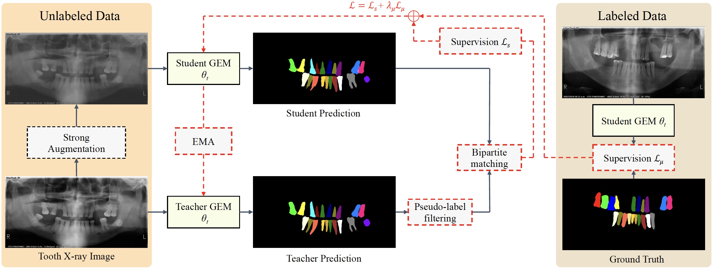

# A novel semi-supervised transformer-based framework for tooth segmentation and identification on panoramic radiography


<div align="center">
  
</div><br/>


Our implementation is based on [detectron2](https://github.com/facebookresearch/detectron2) and provides support for [GEM](https://github.com/isbrycee/GEM). 

## Features
* Semi-supervised distillation training for tooth instance segmentation on 2D  X-ray images
* All the pre-trained models are released. See: https://huggingface.co/Bryceee/SemiTNet/tree/main
* A large-scale dataset TSI15k is released. See: https://huggingface.co/datasets/Bryceee/TISI15k-Dataset

## Installation

Our codebase is based on detectron2 and GEM.
An example of environment installing useful dependencies is provided in [install.md](install.md).

## Prepare Datasets for SemiTNet

If you want to train SemiTNet in a semi-supervised manner, you should change:
*  Labelled data path: data/datasets/builtin.py line 58
*  Labelled data path: data/datasets/builtin.py line 48 (same as the last line)
*  Unlabelled data path: data/datasets/coco_images.py line 91
*  List of classes: python/lib/python3.7/site-packages/detectron2/data/datasets/builtin_meta.py line20 (COCO_CATEGORIES)

You can change the COCO_CATEGORIES for TSI15k dataset into :

```
COCO_CATEGORIES = [
    {"color": [220, 20, 60], "isthing": 1, "id": 1, "name": "1"},
   {"color": [119, 11, 32], "isthing": 1, "id": 2, "name": "2"},
   {"color": [0, 0, 142], "isthing": 1, "id": 3, "name": "4"},
   {"color": [0, 0, 230], "isthing": 1, "id": 4, "name": "5"},
   {"color": [106, 0, 228], "isthing": 1, "id": 5, "name": "6"},
   {"color": [0, 60, 100], "isthing": 1, "id": 6, "name": "7"},
   {"color": [0, 80, 100], "isthing": 1, "id": 7, "name": "8"},
   {"color": [0, 0, 70], "isthing": 1, "id": 8, "name": "9"},
   {"color": [0, 0, 192], "isthing": 1, "id": 9, "name": "10"},
   {"color": [250, 170, 30], "isthing": 1, "id": 10, "name": "11"},
   {"color": [100, 170, 30], "isthing": 1, "id": 11, "name": "12"},
   {"color": [100, 170, 30], "isthing": 1, "id": 12, "name": "13"},
   {"color": [220, 220, 0], "isthing": 1, "id": 13, "name": "15"},
   {"color": [175, 116, 175], "isthing": 1, "id": 14, "name": "16"},
   {"color": [250, 0, 30], "isthing": 1, "id": 15, "name": "17"},
   {"color": [165, 42, 42], "isthing": 1, "id": 16, "name": "19"},
   {"color": [255, 77, 255], "isthing": 1, "id": 17, "name": "20"},
   {"color": [0, 226, 252], "isthing": 1, "id": 18, "name": "21"},
   {"color": [182, 182, 255], "isthing": 1, "id": 19, "name": "22"},
   {"color": [0, 82, 0], "isthing": 1, "id": 20, "name": "23"},
   {"color": [120, 166, 157], "isthing": 1, "id": 21, "name": "24"},
   {"color": [110, 76, 0], "isthing": 1, "id": 22, "name": "25"},
   {"color": [174, 57, 255], "isthing": 1, "id": 23, "name": "26"},
   {"color": [199, 100, 0], "isthing": 1, "id": 24, "name": "27"},
   {"color": [72, 0, 118], "isthing": 1, "id": 25, "name": "28"},
   {"color": [72, 0, 118], "isthing": 1, "id": 26, "name": "30"},
   {"color": [255, 179, 240], "isthing": 1, "id": 27, "name": "32"},
   {"color": [0, 125, 92], "isthing": 1, "id": 28, "name": "18"},
   {"color": [209, 0, 151], "isthing": 1, "id": 29, "name": "29"},
   {"color": [188, 208, 182], "isthing": 1, "id": 30, "name": "3"},
   {"color": [0, 220, 176], "isthing": 1, "id": 31, "name": "14"},
   {"color": [255, 99, 164], "isthing": 1, "id": 32, "name": "31"},
]
```

You can change the COCO_CATEGORIES for MACCAI2024 dataset into :

```
COCO_CATEGORIES = [
    {"color": [220, 20, 60], "isthing": 1, "id": 1, "name": "55"},
    {"color": [119, 11, 32], "isthing": 1, "id": 2, "name": "54"},
    {"color": [0, 0, 142], "isthing": 1, "id": 3, "name": "53"},
    {"color": [0, 0, 230], "isthing": 1, "id": 4, "name": "52"},
    {"color": [106, 0, 228], "isthing": 1, "id": 5, "name": "61"},
    {"color": [0, 60, 100], "isthing": 1, "id": 6, "name": "62"},
    {"color": [0, 80, 100], "isthing": 1, "id": 7, "name": "63"},
    {"color": [0, 0, 70], "isthing": 1, "id": 8, "name": "64"},
    {"color": [0, 0, 192], "isthing": 1, "id": 9, "name": "65"},
    {"color": [250, 170, 30], "isthing": 1, "id": 10, "name": "75"},
    {"color": [230, 150, 140], "isthing": 1, "id": 11, "name": "74"},
    {"color": [128, 64, 128], "isthing": 1, "id": 12, "name": "73"},
    {"color": [244, 35, 232], "isthing": 1, "id": 13, "name": "72"},
    {"color": [70, 70, 70], "isthing": 1, "id": 14, "name": "81"},
    {"color": [102, 102, 156], "isthing": 1, "id": 15, "name": "82"},
    {"color": [190, 153, 153], "isthing": 1, "id": 16, "name": "83"},
    {"color": [180, 165, 180], "isthing": 1, "id": 17, "name": "84"},
    {"color": [150, 100, 100], "isthing": 1, "id": 18, "name": "85"},
    {"color": [107, 142, 35], "isthing": 1, "id": 19, "name": "11"},
    {"color": [152, 251, 152], "isthing": 1, "id": 20, "name": "12"},
    {"color": [70, 130, 180], "isthing": 1, "id": 21, "name": "13"},
    {"color": [220, 20, 60], "isthing": 1, "id": 22, "name": "14"},
    {"color": [230, 190, 255], "isthing": 1, "id": 23, "name": "15"},
    {"color": [255, 0, 0], "isthing": 1, "id": 24, "name": "16"},
    {"color": [0, 0, 142], "isthing": 1, "id": 25, "name": "17"},
    {"color": [255, 204, 54], "isthing": 1, "id": 26, "name": "48"},
    {"color": [0, 153, 153], "isthing": 1, "id": 27, "name": "46"},
    {"color": [220, 220, 0], "isthing": 1, "id": 28, "name": "45"},
    {"color": [107, 142, 35], "isthing": 1, "id": 29, "name": "44"},
    {"color": [152, 251, 152], "isthing": 1, "id": 30, "name": "43"},
    {"color": [70, 130, 180], "isthing": 1, "id": 31, "name": "42"},
    {"color": [220, 20, 60], "isthing": 1, "id": 32, "name": "41"},
    {"color": [230, 190, 255], "isthing": 1, "id": 33, "name": "31"},
    {"color": [255, 0, 0], "isthing": 1, "id": 34, "name": "32"},
    {"color": [0, 0, 142], "isthing": 1, "id": 35, "name": "33"},
    {"color": [255, 204, 54], "isthing": 1, "id": 36, "name": "34"},
    {"color": [0, 153, 153], "isthing": 1, "id": 37, "name": "35"},
    {"color": [220, 220, 0], "isthing": 1, "id": 38, "name": "36"},
    {"color": [119, 11, 32], "isthing": 1, "id": 39, "name": "37"},
    {"color": [0, 0, 142], "isthing": 1, "id": 40, "name": "38"},
    {"color": [0, 0, 142], "isthing": 1, "id": 41, "name": "21"},
    {"color": [119, 11, 32], "isthing": 1, "id": 42, "name": "22"},
    {"color": [0, 0, 142], "isthing": 1, "id": 43, "name": "23"},
    {"color": [0, 0, 142], "isthing": 1, "id": 44, "name": "24"},
    {"color": [0, 0, 142], "isthing": 1, "id": 45, "name": "25"},
    {"color": [0, 0, 142], "isthing": 1, "id": 46, "name": "26"},
    {"color": [0, 0, 142], "isthing": 1, "id": 47, "name": "27"},
    {"color": [0, 0, 142], "isthing": 1, "id": 48, "name": "28"},
    {"color": [0, 0, 142], "isthing": 1, "id": 49, "name": "47"},
    {"color": [0, 0, 142], "isthing": 1, "id": 50, "name": "18"},
    {"color": [0, 0, 142], "isthing": 1, "id": 51, "name": "51"},
    {"color": [0, 0, 142], "isthing": 1, "id": 52, "name": "71"}
]
```


## Model Training 

Training is split into two consecutive steps.

* **Pre-training** : Train the model using the available labeled data.
* **Burn-in and distillation** : Train the student model using both labeled and unlabeled samples with targets provided by the teacher.

The following section provides examples of scripts to launch for different use cases.

### Example

* Train teacher model with available labeled data only :
    ```
    sh run_train_1st.sh
    ```

* Train semi-supervised model using pretrained checkpoint
    ```
    sh run_train_2nd.sh
    ```

You can choose to evaluate either the teacher, the student or both models during semi-supervised training. 
To this end you can add the `SSL.EVAL_WHO` argument to your script and set it to either `STUDENT` (default), `TEACHER` or `BOTH`.

## Model Validation

After training the first step, you can evaluate the performance of teacher model:
    ```
    sh run_eval_teacher.sh
    ```
After training the second step, you can evaluate the performance of student model:
    ```
    sh run_eval_student.sh
    ```

## Model Inference

If you only have images and want to get the masks using our pre-trained model, you can follow steps below:

1. Generate a .json for your images by 'python gen_json_for_inference.py'
2. Select the model you want to use, and start inference by 'sh run_eval_teacher.sh' or 'sh run_eval_student.sh'
3. After step2, we will get the file 'coco_instances_results.json' in the folder 'output/inference', we can get the visualization by 'python ./tools/visual_for_infer_output_json.py'


## <a name="citing"></a>Citing Guided Distillation

If you use SemiTNet in your research or wish to refer to the baseline results published in the manuscript, please use the following BibTeX entry.

```BibTeX
@article{hao2023gem,
  title={GEM: Boost Simple Network for Glass Surface Segmentation via Vision Foundation Models},
  author={Hao, Jing and Liu, Moyun and Yang, Jinrong and Hung, Kuo Feng},
  journal={arXiv e-prints},
  pages={arXiv--2307},
  year={2023}
}
```

## Acknowledgement

Code is largely based on [GuidedDistillation](https://github.com/facebookresearch/GuidedDistillation) and [GEM](https://github.com/isbrycee/GEM).
